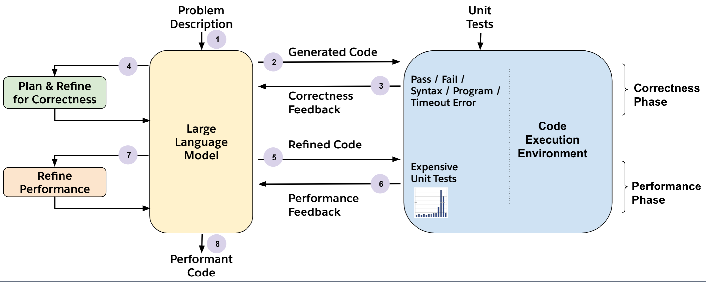

# PerfCodeGen

Official repository to replicate the setup and experiments from our work [PerfCodeGen: Improving Performance of LLM Generated Code with Execution Feedback](TODO).

Blogpost on PerfCodeGen: 



## Overview

Goal: PerfCodeGen is a training-free framework designed to generate optimal code using LLMs for a given programming task that can be verified for correctness and efficiency by a suite of unit tests.

Approach: We apply a straightforward strategy to optimise for performance of LLM generated code besides functional correctness. Given a task description, we first prompt the LLM to generate a candidate solution that is assessed (and self-refined on failure) for correctness by the LLM. After obtaining a functionally correct solution, we perform a self-refine round for runtime-efficiency and conduct a performance assessment using an execution environment to identify the expensive unit tests. The observations from this execution are then passed as verbalised performance feedback to the LLM to re-refine for efficiency.

Key result: We show PerfCodeGen's execution feedback when paired with GPT-4 can generate code more optimal than the ground truth for more than half of HumanEval and MBPP tasks (~47% and ~56% respectively). We prove the effectiveness of PerfCodeGen style execution feedback in improving the efficiency of code generated by LLMs of different sizes including Phi-3-mini, Mixtral-8x7B, Command R, Llama 3 8B, 70B, GPT-3.5 and GPT-4.

<!-- GPT-4 without execution feedback achieves optimisation for (39.26% and 43% respectively). -->

## Instructions to replicate PerfCodeGen

- Requirements: Listed in the `src/requirements.txt` file
- Key python scripts to replicate the experiments:
    - `inference.py`: Used to generate program solutions from LLMs
    - `evaluate_prompt.py`: Used to evaluate the programs

- 

#### Citation

```latex
@article{zhu2024deepseek,
  title={PerfCodeGen: Improving Performance of LLM Generated Code with Execution Feedback},
  author={Peng, Yun and Gotmare, Akhilesh Deepak and Xiong, Caiming and Savarese, Silvio and Lyu, Michael and Sahoo, Doyen},
  journal={arXiv preprint arXiv:TODO},
  year={2024}
}
```

#### TODOs

- remove DS_STORE files
- arxiv link
- blog link